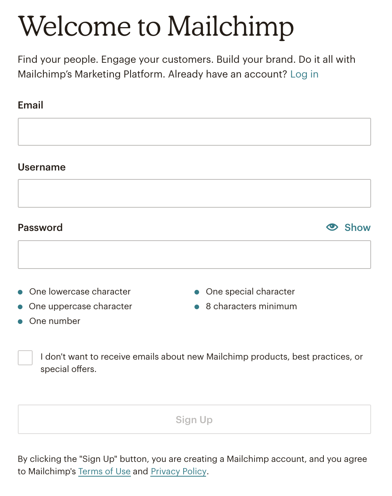
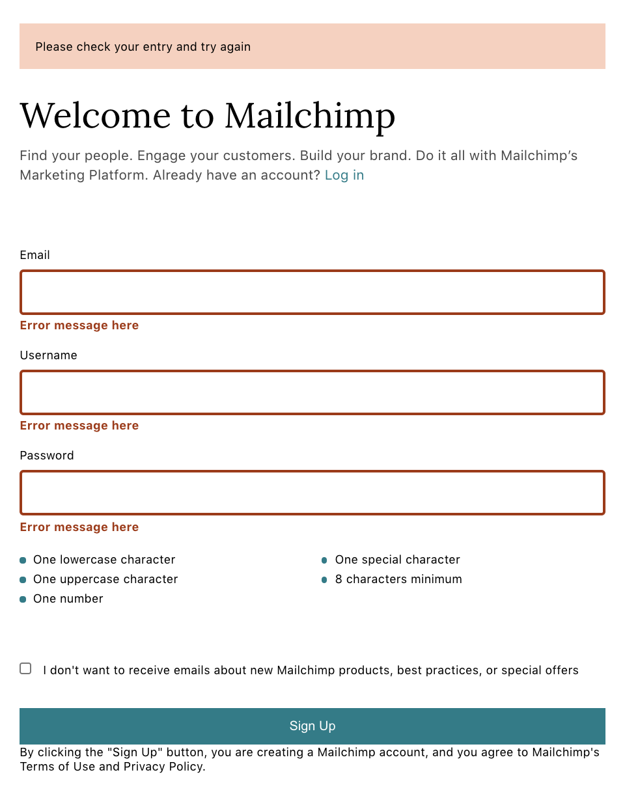
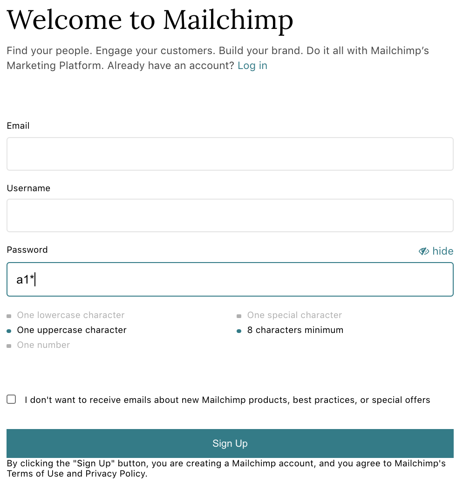

I'm going to recreate some of the sign-up and login forms that are considered best practices.

#### Mailchimp

Mailchimp always gets its name out there when it comes to a great sign-up form. It's clean, friendly and intuitive.

<div style="max-width:400px; box-shadow: 0px 0px 10px 2px rgba(0,0,0,0.02); margin: 2em 0;">

</div>

###### Features that I'm going to focus on

- Show/hide password
- Password requirement hints

###### My process

- Create default UI
- Create UI with all error messages visible
- Enable password show/hide
- Enable password requirement hints

###### 1. UI with all error messages visible

The reason why I create UI with all error messages visible first is because it's easier to make sure I'm not missing anything.

<div style="max-width:400px; box-shadow: 0px 0px 10px 2px rgba(0,0,0,0.02); margin: 2em 0;">

</div>

###### 2. Enabling password show/hide

The password input is set to `type="password"` by default. This hides the text input in the field. When **show** button clicked, it changes to `type="text"` and displays the input.

- Set password input to `type="pasword"`
- Add show/hide button
- When button clicked, change the type to "text", and back to "password" when clicked again. The easiest way to do this is using boolean. When true, set to "password", and when false, set to "text"

<br />

First set password input to `type="password"`

```jsx
const [hidepw, setHidepw] = useState(true)

<InputField type={hidepw ? "password" : "text"} name="password"/>
```

This sets `type="password"` if `hidepw` is `true`. Otherwise, meaning if `false`, set to `type="text"`

<br />

Add show/hide button to the InputField.js component

```jsx
<Label>
  <label htmlFor="">{label}</label>
  {name === "password" && type === "password" ? (
    <Show onClick={handlePassword}>
      <i className="fa fa-eye"></i>
      <span style={{ marginLeft: "0.3em" }}>show</span>
    </Show>
  ) : name === "password" && type === "text" ? (
    <Show onClick={handlePassword}>
      <i className="fa fa-eye-slash"></i>
      <span style={{ marginLeft: "0.3em" }}>hide</span>
    </Show>
  ) : null}
</Label>
```

If `name="password"` and `type="password"`, display show icon. If `name="password` and `type="text"`, display hide icon. Otherwise, meaning if not password input, don't show anything.

<br />

Set `hidepw` to true or false `onClick`

```jsx
const handlePassword = () => {
  setHidepw(!hidepw)
}

;<InputField
  type={hidepw ? "password" : "text"}
  name="password"
  handlePassword={handlePassword}
/>
```

Set `hidepw` to something that's not the current value. Meaning, if true, set to false, if false, set to true.

<br />

###### 3. Enable password requirement hints

Below the password input field, there is a list of 5 bullet points the password is required to have. As you meet the requirement, the corresponding line fades.

- Create className for both required and completed. If condition met, set the className to completed, ir not, set to required.
- Use regex to render className dynamically.

<br/>

Create className and apply css

```jsx
ul {
    list-style: none;

    li {
        line-height: 1.25rem;
    }

    .pw-comp {
        color: #b0b0b0;

        &:before {
        content: "";
        display: inline-block;
        width: 0.5em;
        height: 0.5em;
        border-radius: 0.53em;
        background-color: #b0b0b0;
        margin-right: 0.65em;
        }
    }

    .pw-req {
        &:before {
        content: "";
        display: inline-block;
        width: 0.5em;
        height: 0.5em;
        border-radius: 0.5em;
        background-color: #007c89;
        margin-right: 0.65em;
        }
    }
}
```

list-stye is set to none so that the custom colored bullet point can be applied.

<br />

Use regex to render className dynamically

```jsx
<li className={account.password.match(/(?=.*[a-z])/) ? "pw-comp" : "pw-req"}>
  One lowercase character
</li>
```

Set the className to `"pw-comp"` if the value of `account.passwod` has at least one lowercase character. Otherwise, set it to `"pw-req"`. The `match()` method searches a string for a match against a regular expression. A regular expressions, or regex, are patterns used to match character combinations in strings.

<br />

Apply regex to other conditions as well.

```jsx
<div>
    <ul>
    <li
        className={
        account.password.match(/(?=.*[a-z])/) ? "pw-comp" : "pw-req"
        }
    >
        One lowercase character
    </li>
    <li
        className={
        account.password.match(/(?=.*[A-Z])/) ? "pw-comp" : "pw-req"
        }
    >
        One uppercase character
    </li>
    <li
        className={
        account.password.match(/(?=.*\d)/) ? "pw-comp" : "pw-req"
        }
    >
        One number
    </li>
    </ul>
</div>
<div>
    <ul>
    <li
        className={
        account.password.match(/(?=.*[!@#$%^&*])/)
            ? "pw-comp"
            : "pw-req"
        }
    >
        One special character
    </li>
    <li
        className={
        account.password.match(/.{8,}/) ? "pw-comp" : "pw-req"
        }
    >
        8 characters minimum
    </li>
    </ul>
</div>
```

<br />

As you type, the satisfied bullet point will be faded.

<div style="max-width:400px; box-shadow: 0px 0px 10px 2px rgba(0,0,0,0.02); margin: 2em 0;">

</div>
