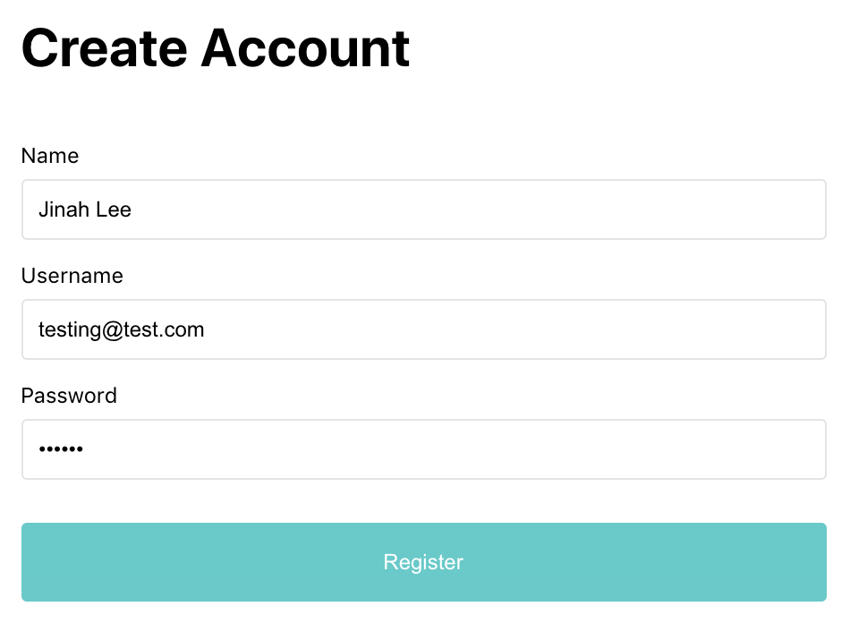
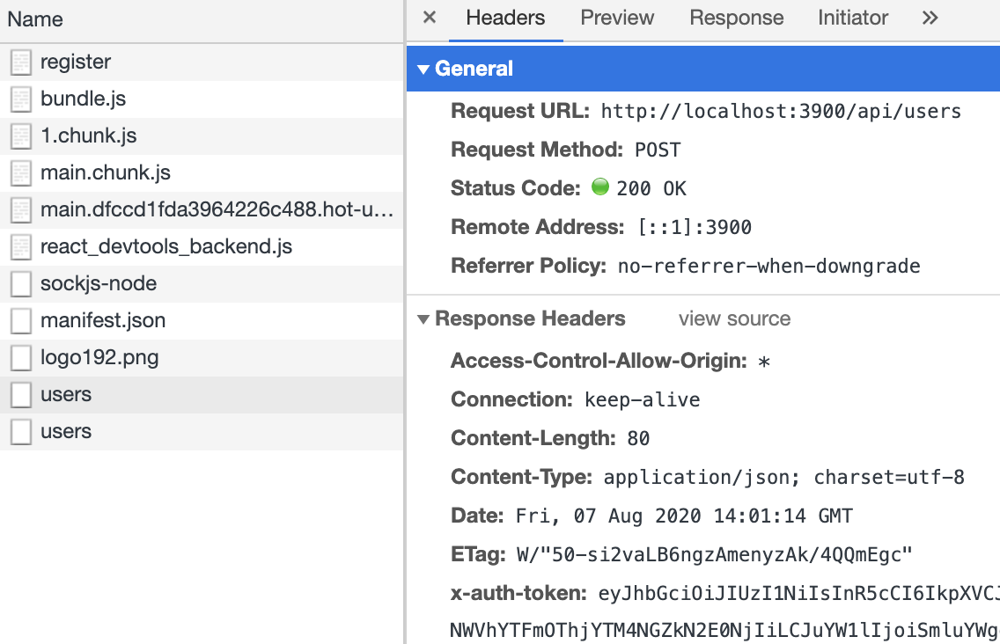
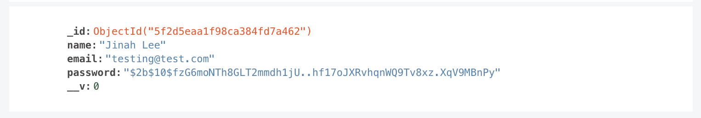

In the [previous section](./building-a-simple-registration-and-login-form-in-react), I created a simple registration form that takes user input and validates for client-side errors.

#### What to do next?

1. We need to send a HTTP request to the server to register a user in the database
2. Server receives the data, and checks for any server side errors.
3. Server tells us whether the request is accepted or rejected.
4. Based on the server response, we need to redirect the user to the appropriate page.

###### 1. Sending an HTTP request to the server

In this example, I'm going to use axios. Install [axios](https://www.npmjs.com/package/axios)

```
npm i axios
```

<br />

Import axios in the Registration.js

```jsx
import axios from "axios"
```

<br />

Call the server onSubmit

```jsx
const handleSubmit = event => {
  event.preventDefault()
  const errors = validate()
  setErrors(errors || {})
  if (errors) return
  //call server
  postData()
}
```

In the `handleSubmit` method, we need to call the server right after client-side validation passes. We will place the call separately inside the `postData` method.

<br />

In the `postData` method, first call the server

```jsx
const postData = () => {
  axios.post("http://localhost:3900/api/users")
}
```

In order to ask the server to accept data, need to send a POST request. Here, I'm sending the request to the backend server that I set up with the node.js and mogodb.

<br />

But what are we asking the server to accept? The user input.

```jsx
const postData = () => {
  const userData = {
    name: account.name,
    email: account.username,
    password: account.password,
  }
  axios.post("http://localhost:3900/api/users", userData)
}
```

Include user input in the body of the request. The keys should match with the backend.

<br />

The request will return a promise. [What's a promise?](./glossary-things-i-must-know-as-a-front-end-developer)

```jsx
const postData = async () => {
  const obj = {
    name: account.name,
    email: account.username,
    password: account.password,
  }
  const response = await axios.post("http://localhost:3900/api/users", obj)
}
```

We need to `await` for the promise, and place the response in a const. Lastly, decorate the function with an async keyword.

<br />

Now test registering a user

<div style="max-width:400px; box-shadow: 0px 0px 10px 2px rgba(0,0,0,0.02); margin: 2em 0;">

</div>

<br />

Once Register button clicked, check the Network tab in the Chrome developer tool

<div style="max-width:400px; box-shadow: 0px 0px 10px 2px rgba(0,0,0,0.02); margin: 2em 0;">

</div>
Under users, Status code shows 200 OK. Successfully saved the user data in the server.

<br />

It successfully shows up in the MongoDB as well

<div style="max-width:400px; box-shadow: 0px 0px 10px 2px rgba(0,0,0,0.02); margin: 2em 0;">

</div>

To be continued...
