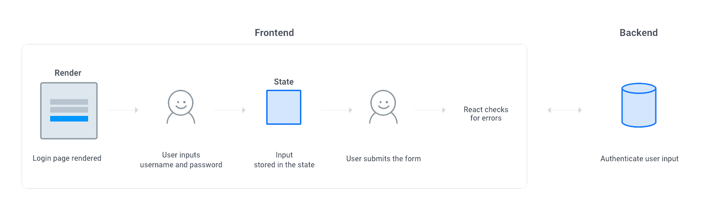
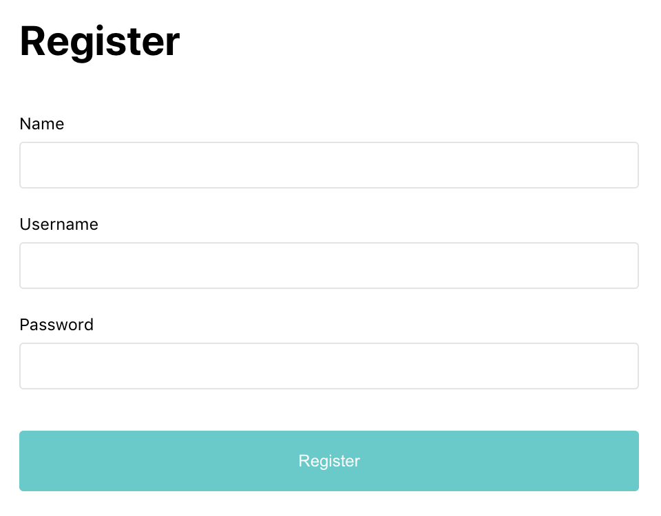
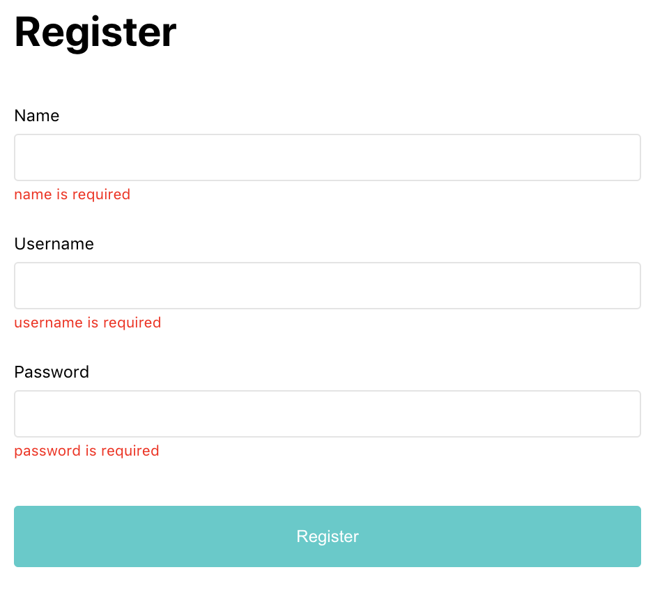

In this post, I'm going to go over how to create a simple form in React.  I'll focus on the client side: creating the basic UI, saving the user-submitted data, and validating the form.
<br />

##### Understanding the flow


**The basic flow**

1. The login/registration page is rendered on the screen
2. User inputs value into the field
3. User input value is saved in the state
4. User clicks the submit button
5. Client side form validation
6. Server side authentication

<br />

##### 1. Creating the basic UI

It will be based on this wireframe,
<div style="width:500px">

</div>

in this structure

```
├── form
│   └── div
│       └── label
│       └── input		
│   └── div
│       └── label
│       └── input	
│   └── div
│       └── label
│       └── input	
│   └── button
```

<br />

Using JSX and [styled-components](https://styled-components.com/), I can translate into React like the following.

```jsx
--Registration.js--

import React from "react";

//import styles and assets
import styled from "styled-components";

const Registration = () => {
  return (
    <Container>
      <Header>
        <h1>Register</h1>
      </Header>
      <Form>
        <div className="form-group">
          <label htmlFor="">Name</label>
          <input type="text" className="textinput" />
        </div>
        <div className="form-group">
          <label htmlFor="">Username</label>
          <input type="text" className="textinput" />
        </div>
        <div className="form-group">
          <label htmlFor="">Password</label>
          <input type="password" className="textinput" />
        </div>
        <button>Register</button>
      </Form>
    </Container>
  );
};

const Container = styled.div`
  width: 100%;
  max-width: 600px;
  margin: 0 auto;
`;

const Header = styled.header`
  margin: 3em 0;

  h1 {
    font-size: 2.5rem;
  }
`;

const Form = styled.form`
  width: 100%;

  .form-group {
    padding-bottom: 1em;
  }

  .textinput {
    width: 100%;
    font-size: 1rem;
    border: 1px solid #e4e4e4;
    border-radius: 0.25em;
    padding: 0.75em;
    margin: 0.5em 0;
  }

  button {
    width: 100%;
    background-color: #3fccca;
    border: none;
    outline: none;
    border-radius: 0.25em;
    font-size: 1rem;
    color: #fff;
    padding: 1.25em 0;
    margin: 1em 0;
    cursor: pointer;
  }
`;

export default Registration;
```
<br />

We can extract input fields into a reusable component, and make it controlled.

```jsx
--InputField.js--

import React from "react";

//import styles and assets
import styled from "styled-components";

const InputField = ({ label, type, value }) => {
  return (
    <Container>
      <label htmlFor="">{label}</label>
      <Input type={type} value={value}/>
    </Container>
  );
};

const Container = styled.div`
  padding-bottom: 1em;
`;

const Input = styled.input`
  width: 100%;
  font-size: 1rem;
  border: 1px solid #e4e4e4;
  border-radius: 0.25em;
  padding: 0.75em;
  margin: 0.5em 0;
`;

export default InputField;
```
<br />
Import it into the Registration.js file

```jsx
--Registration.js--
import InputField from "../components/InputField";

const Registration = () => {
  return (
    <Container>
      <Header>
        <h1>Register</h1>
      </Header>
      <Form>
        <InputField label="Name" type="text" />
        <InputField label="Username" type="text" />
        <InputField label="Password" type="password" />
        <button>Register</button>
      </Form>
    </Container>
  );
};

```

Now the page is rendered on the screen
<div style="width:480px"></div>

<br />

##### 2. Saving the user input

Now when user types in, we need to store the value in the state. The value in the state will be validated, then sent to the server.

First, create the state

```jsx
const [account, setAccount] = useState({
  name: "",
  username: "",
  password: "",
});
```

<br />

Sync `InputField` to the state

```jsx
<InputField value={account.name} label="Name" type="text" />
<InputField value={account.username} label="Username" type="text" />
<InputField value={account.password} label="Password" type="password" />
```

- This is done by adding value attribute to the `input` and assigning it to the state.  Now the value stored in the state is displayed in the input field.  Initially, I set the state to "" so that input field is left blank by default.

<br />

Whenever user types something, store the value in the state

```jsx
--Registration.js--

<InputField value={account.name} label="Name" type="text" handleChange={handleChange}/>
<InputField value={account.username} label="Username" type="text" handleChange={handleChange}/>
<InputField value={account.password} label="Password" type="password" handleChange={handleChange}/>

--InputField.js--
<Input type={type} value={value} onChange={handleChange} />

```
- This is done by calling a function with onChange method from the InputField component.
- `onChange`, meaning whenever user types something in the input field, call `handleChange`, a function that will update the state.

<br />

Create `handleChange` function 

```jsx
--Registration.js--

const handleChange = ({ currentTarget: input}) => {
  const userInput = { ...account };
  userInput[input.name] = input.value;
  setAccount(userInput);
};
```

This method will listen to the input field's change in value (event), in this case renamed as (input), and update the state. 

- Can't update the state directly, so clone the state first
- Then set the cloned object to the user input value
- Instead of `userInput.username` or `userInput.password`, write `userInput[input.name]` so that it can bring the name of the current event.
- Lastly set the original state to the changed object

Now the state is updated with user input

<br />

##### 3. Validating user input

When user clicks the Submit button, `onSubmit`, I want to validate the value stored in the state for any client-side errors. Once validated, it will be sent to the server for authentication.

This is how it should look like when there's any error.

<div style="width:300px">

</div>

In the Input component, decide where to display error message. If there's any error, I want it to show up right below the input field.

```jsx
--InputField.js--

const InputField = ({ error, label, name, type, value, handleChange }) => {
  return (
    <Container>
      <label htmlFor="">{label}</label>
      <Input name={name} type={type} value={value} onChange={handleChange} />
      {error && <Error>{error}</Error>}
    </Container>
  );
};
```

<br />

How do I know if there's any error? `onSubmit`, call a method to validate.  If input value doesn't pass the validation, return an error message and store it in the state.  The error message then will be passed down to the InputField component.

Create a state where you want to store error messages.

```jsx
--Registration.js--

const [errors, setErrors] = useState({ });
```

<br />

`onSubmit`, call `handleSubmit` method.

```jsx
<form onSubmit={handleSubmit}>
```

<br />

Create `handleSubmit` method
```jsx
const handleSubmit = (event) => {
  event.preventDefault();
  const errors = validate();
  setError(errors);
  if (errors) return;
  // call server
};
```
In this method, we will
- Add `preventDefault()` to prevent full page reload on click.
- Call `validate()` which will check for an errors and return error messages if there's any.
- If `validate()` returns a message, store it in the state.
- And **do not** proceed to the next step, which is calling the server for authentication.

<br />

Create `validate()` method
```jsx
const validate = () => {
  const errors = {};
  if (account.name === "") {
    errors.name = "name is required";
  }
  if (account.username === "") {
    errors.username = "username is required";
  }
  if (account.password === "") {
    errors.password = "password is required";
  }
  return errors;
};
```
<br />

Pass the error message to the InputField component
```jsx
<InputField
  error={errors.name}
  name="name"
  value={account.name}
  label="Name"
  type="text"
  handleChange={handleChange}
/>
```

This is how it's rendered on the screen.
<div style="width:480px">

</div>

We can follow the same steps to create a login form.
Now it's time to authenticate the data with the server. [link here]()